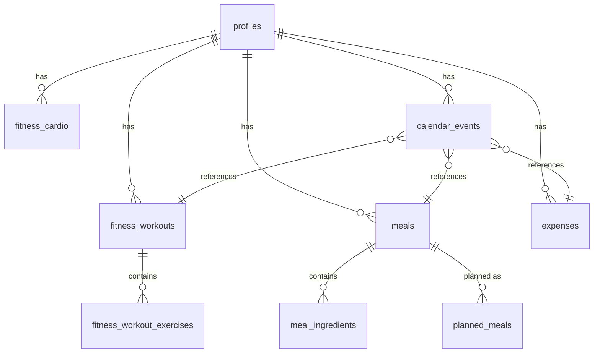

# Life OS Architecture Documentation

This document provides a comprehensive overview of the Life OS system architecture, design patterns, and technical decisions.

## 📋 Table of Contents

- [System Overview](#system-overview)
- [Architecture Patterns](#architecture-patterns)
- [Technology Stack](#technology-stack)
- [Data Flow](#data-flow)
- [Component Architecture](#component-architecture)
- [Database Design](#database-design)
- [API Architecture](#api-architecture)
- [Security Architecture](#security-architecture)
- [Performance Architecture](#performance-architecture)
- [Scalability Considerations](#scalability-considerations)
- [Deployment Architecture](#deployment-architecture)

## 🏗️ System Overview

Life OS is a comprehensive life management platform built with a modern, scalable architecture that integrates AI-powered features with real-time data synchronization across multiple life domains.

### Core Principles

- **Modular Design**: Loosely coupled, highly cohesive components
- **Type Safety**: Full TypeScript implementation for reliability
- **Real-time Updates**: WebSocket-based synchronization
- **AI Integration**: OpenAI GPT-4 for intelligent recommendations
- **Cross-domain Sync**: Unified calendar system across all features
- **Performance First**: Optimized for speed and user experience

### High-Level Architecture

```
┌─────────────────┐    ┌─────────────────┐    ┌─────────────────┐
│   Frontend      │    │   Backend       │    │   External      │
│   (Next.js)     │◄──►│   (Supabase)    │◄──►│   Services      │
└─────────────────┘    └─────────────────┘    └─────────────────┘
         │                       │                       │
         │                       │                       │
         ▼                       ▼                       ▼
┌─────────────────┐    ┌─────────────────┐    ┌─────────────────┐
│   React App     │    │   PostgreSQL    │    │   OpenAI API    │
│   Components    │    │   Database      │    │   Sentry        │
└─────────────────┘    └─────────────────┘    └─────────────────┘
```

## 🎯 Architecture Patterns

### Frontend Architecture

#### Component Hierarchy
```
App
├── Layout
│   ├── Navigation
│   ├── Sidebar
│   └── Main Content
├── Pages
│   ├── Dashboard
│   ├── Fitness
│   ├── Food
│   ├── Finances
│   └── Profile
└── Shared Components
    ├── Modals
    ├── Forms
    ├── UI Elements
    └── Utilities
```

#### State Management
- **React Context**: Global state (user, theme, notifications)
- **React Query**: Server state management and caching
- **Local State**: Component-specific state with useState/useReducer
- **URL State**: Route parameters and query strings

#### Data Flow Pattern
```
User Action → Component → Hook → API → Database → Response → UI Update
```

### Backend Architecture

#### API Layer
- **Next.js API Routes**: Serverless functions for API endpoints
- **Supabase Client**: Direct database access with RLS
- **Middleware**: Authentication, validation, error handling

#### Database Layer
- **PostgreSQL**: Primary database with advanced features
- **Row Level Security**: Data isolation and security
- **Real-time Subscriptions**: Live data updates
- **Full-text Search**: Advanced search capabilities

## 🛠️ Technology Stack

### Frontend Technologies

#### Core Framework
- **Next.js 15.3.5**: React framework with SSR/SSG
- **React 19**: Latest React with concurrent features
- **TypeScript 5.0**: Type-safe development

#### UI & Styling
- **Tailwind CSS 3.0**: Utility-first CSS framework
- **Lucide React**: Modern icon library
- **React Icons**: Comprehensive icon collection
- **Framer Motion**: Animation library (optional)

#### State Management
- **React Query (TanStack Query)**: Server state management
- **React Context**: Global state management
- **Zustand**: Lightweight state management (optional)

#### Development Tools
- **ESLint**: Code linting and quality
- **Prettier**: Code formatting
- **Jest**: Unit testing framework
- **React Testing Library**: Component testing
- **Playwright**: End-to-end testing

### Backend Technologies

#### Database & Backend
- **Supabase**: Backend-as-a-Service platform
- **PostgreSQL**: Primary database
- **PostgREST**: Auto-generated REST API
- **Realtime**: WebSocket subscriptions

#### Authentication
- **Supabase Auth**: Built-in authentication system
- **JWT Tokens**: Stateless authentication
- **Social Login**: OAuth providers integration

#### External Services
- **OpenAI GPT-4**: AI-powered recommendations
- **Sentry**: Error monitoring and performance
- **Vercel**: Hosting and deployment platform

## 🔄 Data Flow

### User Authentication Flow
```
1. User Login → 2. Supabase Auth → 3. JWT Token → 4. API Access
```

### Data Synchronization Flow
```
1. User Action → 2. API Call → 3. Database Update → 4. Real-time Broadcast → 5. UI Update
```

### AI Integration Flow
```
1. User Request → 2. OpenAI API → 3. AI Processing → 4. Structured Response → 5. UI Display
```

### Calendar Integration Flow
```
1. Entity Creation → 2. Calendar Event Generation → 3. Cross-domain Sync → 4. Real-time Update
```

## 🧩 Component Architecture

### Core Components

#### Layout Components
```typescript
interface LayoutProps {
  children: ReactNode;
  user?: User;
  loading?: boolean;
}

// Main layout wrapper
const Layout: React.FC<LayoutProps> = ({ children, user, loading }) => {
  return (
    <div className="min-h-screen bg-background">
      <Navigation user={user} />
      <Sidebar />
      <main className="flex-1">{children}</main>
    </div>
  );
};
```

#### Modal System
```typescript
interface ModalProps {
  isOpen: boolean;
  onClose: () => void;
  title: string;
  children: ReactNode;
}

// Base modal component
const BaseModal: React.FC<ModalProps> = ({ isOpen, onClose, title, children }) => {
  // Modal implementation
};
```

#### Form Components
```typescript
interface FormFieldProps {
  label: string;
  error?: string;
  required?: boolean;
  children: ReactNode;
}

// Reusable form field
const FormField: React.FC<FormFieldProps> = ({ label, error, required, children }) => {
  // Form field implementation
};
```

### Feature Components

#### Calendar System
```typescript
interface CalendarViewProps {
  events: CalendarEvent[];
  onEventClick: (event: CalendarEvent) => void;
  onEventDrop: (event: CalendarEvent, newDate: Date) => void;
}

// Main calendar component
const CalendarView: React.FC<CalendarViewProps> = ({ events, onEventClick, onEventDrop }) => {
  // Calendar implementation with drag-and-drop
};
```

#### AI Integration
```typescript
interface AIServiceProps {
  prompt: string;
  systemPrompt?: string;
  temperature?: number;
  maxTokens?: number;
}

// AI service wrapper
const AIService: React.FC<AIServiceProps> = ({ prompt, systemPrompt, temperature, maxTokens }) => {
  // AI integration implementation
};
```

## 🗄️ Database Design

### Core Tables

#### Users & Authentication
```sql
-- User profiles (extends Supabase auth.users)
CREATE TABLE profiles (
  id UUID REFERENCES auth.users(id) PRIMARY KEY,
  email TEXT UNIQUE NOT NULL,
  first_name TEXT,
  last_name TEXT,
  avatar_url TEXT,
  preferences JSONB DEFAULT '{}',
  created_at TIMESTAMP WITH TIME ZONE DEFAULT NOW(),
  updated_at TIMESTAMP WITH TIME ZONE DEFAULT NOW()
);

-- User sessions for tracking
CREATE TABLE user_sessions (
  id UUID DEFAULT gen_random_uuid() PRIMARY KEY,
  user_id UUID REFERENCES profiles(id) ON DELETE CASCADE,
  session_type TEXT NOT NULL, -- 'workout', 'cardio', 'cooking'
  status TEXT DEFAULT 'active', -- 'active', 'paused', 'completed'
  started_at TIMESTAMP WITH TIME ZONE DEFAULT NOW(),
  ended_at TIMESTAMP WITH TIME ZONE,
  data JSONB DEFAULT '{}'
);
```

#### Fitness Management
```sql
-- Workouts table
CREATE TABLE fitness_workouts (
  id UUID DEFAULT gen_random_uuid() PRIMARY KEY,
  name TEXT NOT NULL,
  date DATE NOT NULL,
  duration_minutes INTEGER,
  notes TEXT,
  user_id UUID REFERENCES profiles(id) ON DELETE CASCADE,
  created_at TIMESTAMP WITH TIME ZONE DEFAULT NOW()
);

-- Workout exercises
CREATE TABLE fitness_workout_exercises (
  id UUID DEFAULT gen_random_uuid() PRIMARY KEY,
  workout_id UUID REFERENCES fitness_workouts(id) ON DELETE CASCADE,
  name TEXT NOT NULL,
  sets JSONB NOT NULL, -- Array of set objects
  notes TEXT,
  order_index INTEGER DEFAULT 0
);

-- Cardio sessions
CREATE TABLE fitness_cardio (
  id UUID DEFAULT gen_random_uuid() PRIMARY KEY,
  activity_type TEXT NOT NULL,
  date DATE NOT NULL,
  duration_minutes INTEGER,
  distance_miles DECIMAL(5,2),
  calories_burned INTEGER,
  notes TEXT,
  user_id UUID REFERENCES profiles(id) ON DELETE CASCADE,
  created_at TIMESTAMP WITH TIME ZONE DEFAULT NOW()
);
```

#### Meal Management
```sql
-- Meals table
CREATE TABLE meals (
  id UUID DEFAULT gen_random_uuid() PRIMARY KEY,
  name TEXT NOT NULL,
  description TEXT,
  prep_time INTEGER,
  cook_time INTEGER,
  servings INTEGER,
  instructions TEXT[],
  user_id UUID REFERENCES profiles(id) ON DELETE CASCADE,
  created_at TIMESTAMP WITH TIME ZONE DEFAULT NOW()
);

-- Meal ingredients
CREATE TABLE meal_ingredients (
  id UUID DEFAULT gen_random_uuid() PRIMARY KEY,
  meal_id UUID REFERENCES meals(id) ON DELETE CASCADE,
  food_item_name TEXT NOT NULL,
  quantity DECIMAL(8,2) NOT NULL,
  unit TEXT NOT NULL
);

-- Pantry items
CREATE TABLE pantry_items (
  id UUID DEFAULT gen_random_uuid() PRIMARY KEY,
  name TEXT NOT NULL,
  quantity DECIMAL(8,2) NOT NULL,
  unit TEXT NOT NULL,
  expiry_date DATE,
  user_id UUID REFERENCES profiles(id) ON DELETE CASCADE,
  created_at TIMESTAMP WITH TIME ZONE DEFAULT NOW()
);

-- Planned meals
CREATE TABLE planned_meals (
  id UUID DEFAULT gen_random_uuid() PRIMARY KEY,
  meal_id UUID REFERENCES meals(id) ON DELETE CASCADE,
  planned_date DATE NOT NULL,
  meal_time TIME,
  user_id UUID REFERENCES profiles(id) ON DELETE CASCADE,
  created_at TIMESTAMP WITH TIME ZONE DEFAULT NOW()
);
```

#### Financial Management
```sql
-- Expenses table
CREATE TABLE expenses (
  id UUID DEFAULT gen_random_uuid() PRIMARY KEY,
  name TEXT NOT NULL,
  amount DECIMAL(10,2) NOT NULL,
  category TEXT NOT NULL,
  store TEXT,
  payment_method TEXT,
  date DATE NOT NULL,
  notes TEXT,
  user_id UUID REFERENCES profiles(id) ON DELETE CASCADE,
  created_at TIMESTAMP WITH TIME ZONE DEFAULT NOW()
);

-- Receipts table
CREATE TABLE receipts (
  id UUID DEFAULT gen_random_uuid() PRIMARY KEY,
  store TEXT NOT NULL,
  amount DECIMAL(10,2) NOT NULL,
  date DATE NOT NULL,
  image_url TEXT,
  user_id UUID REFERENCES profiles(id) ON DELETE CASCADE,
  created_at TIMESTAMP WITH TIME ZONE DEFAULT NOW()
);
```

#### Calendar System
```sql
-- Calendar events
CREATE TABLE calendar_events (
  id UUID DEFAULT gen_random_uuid() PRIMARY KEY,
  title TEXT NOT NULL,
  start_time TIMESTAMP WITH TIME ZONE NOT NULL,
  end_time TIMESTAMP WITH TIME ZONE,
  source TEXT NOT NULL, -- 'meal', 'workout', 'cardio', 'expense'
  source_id UUID NOT NULL,
  user_id UUID REFERENCES profiles(id) ON DELETE CASCADE,
  created_at TIMESTAMP WITH TIME ZONE DEFAULT NOW()
);
```

### Database Relationships



### Row Level Security (RLS)

```sql
-- Enable RLS on all tables
ALTER TABLE profiles ENABLE ROW LEVEL SECURITY;
ALTER TABLE fitness_workouts ENABLE ROW LEVEL SECURITY;
ALTER TABLE meals ENABLE ROW LEVEL SECURITY;
ALTER TABLE expenses ENABLE ROW LEVEL SECURITY;
ALTER TABLE calendar_events ENABLE ROW LEVEL SECURITY;

-- Create policies for user data isolation
CREATE POLICY "Users can view own data" ON fitness_workouts
  FOR SELECT USING (auth.uid() = user_id);

CREATE POLICY "Users can insert own data" ON fitness_workouts
  FOR INSERT WITH CHECK (auth.uid() = user_id);

CREATE POLICY "Users can update own data" ON fitness_workouts
  FOR UPDATE USING (auth.uid() = user_id);

CREATE POLICY "Users can delete own data" ON fitness_workouts
  FOR DELETE USING (auth.uid() = user_id);
```

## 🔌 API Architecture

### RESTful API Design

#### Endpoint Structure
```
/api/
├── auth/
│   ├── user
│   └── refresh
├── calendar/
│   ├── list
│   ├── insert
│   ├── update
│   └── delete
├── fitness/
│   ├── workouts
│   ├── cardio
│   ├── sports
│   └── stretching
├── meals/
│   ├── list
│   ├── create
│   ├── update
│   └── delete
├── pantry/
│   ├── list
│   └── insert
├── finances/
│   ├── expenses
│   └── receipts
└── ai/
    ├── meal-suggestions
    └── workout-suggestions
```

#### API Response Format
```typescript
interface APIResponse<T> {
  data?: T;
  error?: string;
  message?: string;
  timestamp: string;
}

interface PaginatedResponse<T> {
  data: T[];
  total: number;
  page: number;
  limit: number;
  hasMore: boolean;
}
```

### WebSocket Architecture

#### Real-time Events
```typescript
interface WebSocketEvent {
  type: string;
  data: any;
  timestamp: string;
  user_id?: string;
}

// Event types
type EventType = 
  | 'calendar:update'
  | 'fitness:session:update'
  | 'meal:cooking:update'
  | 'user:status:change';
```

#### WebSocket Connection Management
```typescript
class WebSocketManager {
  private socket: WebSocket | null = null;
  private reconnectAttempts = 0;
  private maxReconnectAttempts = 5;

  connect() {
    // WebSocket connection logic
  }

  subscribe(eventType: string, callback: (data: any) => void) {
    // Subscription logic
  }

  publish(eventType: string, data: any) {
    // Publishing logic
  }
}
```

## 🔒 Security Architecture

### Authentication & Authorization

#### JWT Token Management
```typescript
interface JWTPayload {
  sub: string; // User ID
  email: string;
  exp: number; // Expiration time
  iat: number; // Issued at
  aud: string; // Audience
}

class TokenManager {
  static getToken(): string | null {
    // Token retrieval logic
  }

  static refreshToken(): Promise<string> {
    // Token refresh logic
  }

  static validateToken(token: string): boolean {
    // Token validation logic
  }
}
```

#### API Security Middleware
```typescript
import { NextApiRequest, NextApiResponse } from 'next';
import { createMiddleware } from 'next-api-middleware';

const authMiddleware = createMiddleware(async (req: NextApiRequest, res: NextApiResponse) => {
  const token = req.headers.authorization?.replace('Bearer ', '');
  
  if (!token) {
    return res.status(401).json({ error: 'Authentication required' });
  }

  try {
    const user = await validateToken(token);
    req.user = user;
    return;
  } catch (error) {
    return res.status(401).json({ error: 'Invalid token' });
  }
});
```

### Data Security

#### Input Validation
```typescript
import { z } from 'zod';

const mealSchema = z.object({
  name: z.string().min(1).max(100),
  description: z.string().max(500).optional(),
  prep_time: z.number().min(0).max(480),
  cook_time: z.number().min(0).max(480),
  servings: z.number().min(1).max(50),
  instructions: z.array(z.string()).max(20),
  ingredients: z.array(z.object({
    food_item_name: z.string().min(1).max(100),
    quantity: z.number().positive(),
    unit: z.string().min(1).max(20)
  }))
});
```

#### SQL Injection Prevention
- Use parameterized queries with Supabase client
- Implement input sanitization
- Use TypeScript for type safety

#### XSS Prevention
- Sanitize user inputs
- Use React's built-in XSS protection
- Implement Content Security Policy (CSP)

## ⚡ Performance Architecture

### Frontend Performance

#### Code Splitting
```typescript
// Dynamic imports for heavy components
const CalendarView = dynamic(() => import('@/components/CalendarView'), {
  loading: () => <CalendarSkeleton />,
  ssr: false
});

const WorkoutDetailsModal = dynamic(() => import('@/components/modals/WorkoutDetailsModal'), {
  loading: () => <ModalSkeleton />
});
```

#### Caching Strategy
```typescript
// React Query caching configuration
const queryClient = new QueryClient({
  defaultOptions: {
    queries: {
      staleTime: 5 * 60 * 1000, // 5 minutes
      cacheTime: 10 * 60 * 1000, // 10 minutes
      retry: 3,
      refetchOnWindowFocus: false
    }
  }
});
```

#### Bundle Optimization
```javascript
// next.config.js
module.exports = {
  experimental: {
    optimizeCss: true,
    optimizePackageImports: ['lucide-react', 'react-icons']
  },
  webpack: (config, { dev, isServer }) => {
    // Bundle optimization
    if (!dev && !isServer) {
      config.optimization.splitChunks.cacheGroups = {
        vendor: {
          test: /[\\/]node_modules[\\/]/,
          name: 'vendors',
          chunks: 'all'
        }
      };
    }
    return config;
  }
};
```

### Backend Performance

#### Database Optimization
```sql
-- Indexes for performance
CREATE INDEX idx_fitness_workouts_user_date ON fitness_workouts(user_id, date);
CREATE INDEX idx_meals_user_created ON meals(user_id, created_at);
CREATE INDEX idx_calendar_events_user_start ON calendar_events(user_id, start_time);

-- Full-text search indexes
CREATE INDEX idx_meals_name_search ON meals USING gin(to_tsvector('english', name));
CREATE INDEX idx_meals_description_search ON meals USING gin(to_tsvector('english', description));
```

#### API Response Caching
```typescript
// API route with caching
export default async function handler(req: NextApiRequest, res: NextApiResponse) {
  // Set cache headers
  res.setHeader('Cache-Control', 's-maxage=10, stale-while-revalidate');
  
  // API logic
  const data = await fetchData();
  res.json(data);
}
```

## 📈 Scalability Considerations

### Horizontal Scaling

#### Stateless Architecture
- No server-side sessions
- JWT-based authentication
- Database as single source of truth

#### Load Balancing
- Multiple API instances
- CDN for static assets
- Database read replicas

### Database Scaling

#### Connection Pooling
```typescript
// Supabase client configuration
const supabase = createClient(
  process.env.NEXT_PUBLIC_SUPABASE_URL!,
  process.env.NEXT_PUBLIC_SUPABASE_ANON_KEY!,
  {
    db: {
      schema: 'public'
    },
    auth: {
      persistSession: true,
      autoRefreshToken: true
    }
  }
);
```

#### Query Optimization
- Use database indexes
- Implement pagination
- Optimize complex queries
- Use database views for common queries

### Caching Strategy

#### Multi-level Caching
1. **Browser Cache**: Static assets and API responses
2. **CDN Cache**: Global content delivery
3. **Application Cache**: React Query cache
4. **Database Cache**: Query result caching

## 🚀 Deployment Architecture

### Production Environment

#### Infrastructure
```
┌─────────────────┐    ┌─────────────────┐    ┌─────────────────┐
│   CDN           │    │   Load Balancer │    │   Application   │
│   (Cloudflare)  │◄──►│   (Vercel)      │◄──►│   Instances     │
└─────────────────┘    └─────────────────┘    └─────────────────┘
         │                       │                       │
         │                       │                       │
         ▼                       ▼                       ▼
┌─────────────────┐    ┌─────────────────┐    ┌─────────────────┐
│   Static Assets │    │   API Gateway   │    │   Database      │
│   (S3/Vercel)   │    │   (Next.js)     │    │   (Supabase)    │
└─────────────────┘    └─────────────────┘    └─────────────────┘
```

#### Environment Configuration
```yaml
# docker-compose.prod.yml
version: '3.8'
services:
  app:
    build: .
    ports:
      - "3000:3000"
    environment:
      - NODE_ENV=production
      - NEXT_PUBLIC_SUPABASE_URL=${NEXT_PUBLIC_SUPABASE_URL}
      - NEXT_PUBLIC_SUPABASE_ANON_KEY=${NEXT_PUBLIC_SUPABASE_ANON_KEY}
      - SUPABASE_SERVICE_ROLE_KEY=${SUPABASE_SERVICE_ROLE_KEY}
      - OPENAI_API_KEY=${OPENAI_API_KEY}
    restart: unless-stopped
    healthcheck:
      test: ["CMD", "curl", "-f", "http://localhost:3000/api/health"]
      interval: 30s
      timeout: 10s
      retries: 3
```

### Monitoring & Observability

#### Application Monitoring
- **Sentry**: Error tracking and performance monitoring
- **Vercel Analytics**: Web vitals and user analytics
- **Custom Metrics**: Business-specific KPIs

#### Infrastructure Monitoring
- **Database Monitoring**: Query performance and connection health
- **API Monitoring**: Response times and error rates
- **Uptime Monitoring**: Service availability

---

**For detailed implementation guides, visit our [Architecture Documentation](https://docs.lifeos.app/architecture).**
